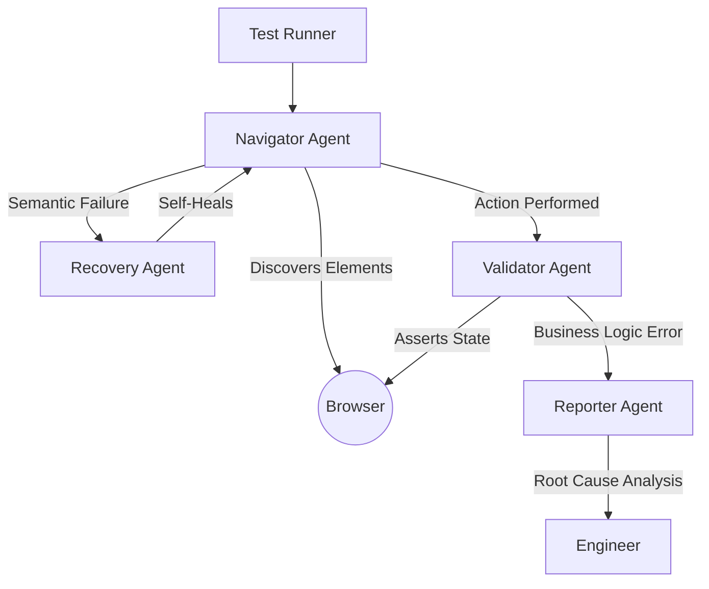

# Multi-Agent Playwright Framework: Architectural Specification

## 1. Production Context & Pain Points
Modern software delivery requires reliable, high-speed end-to-end (E2E) testing. However, traditional Playwright frameworks often encounter specific production "pain points" that hinder CI/CD efficiency:

*   **Flaky Tests (The Synchronization Gap)**:
    *   *Cause*: Non-deterministic timing in Single Page Applications (SPAs) where DOM hydration or API responses vary by milliseconds.
    *   *Effect*: Tests fail unpredictably, eroding trust in the automation suite and causing "false alarms" for engineering teams.
*   **Regression Delays (The Maintenance Overhead)**:
    *   *Cause*: Static locators (ID, CSS, XPath) break when UI components are refactored, even if the business logic remains unchanged.
    *   *Effect*: Developers spend significant time updating Page Objects instead of shipping features.
*   **Environment Instability (Transient Failures)**:
    *   *Cause*: Temporary network latency, container cold starts, or third-party API throttling.
    *   *Effect*: Traditional scripts lack the context to distinguish between a functional bug and an infrastructure hiccup.

---

## 2. Proposed Multi-Agent Architecture
This framework shifts from linear script execution to an **Autonomous Orchestration** model using the Model Context Protocol (MCP).

### A. Navigator Agent (The Explorer)
*   **Primary Goal**: Execute user intent by discovering the optimal path to interaction.
*   **Mechanism**: Uses semantic searching (e.g., "Find the 'Submit' button that is currently enabled and visible") rather than hardcoded selectors.
*   **Outcome**: Higher resilience to UI layout changes.

### B. Validator Agent (The Auditor)
*   **Primary Goal**: Verify system state post-interaction.
*   **Mechanism**: Performs deep-link validation and DOM snapshots to ensure the application isn't just "present" but "correct." It correlates UI state with expected business outcomes.

### C. Recovery Agent (The Healer)
*   **Primary Goal**: Minimize manual triage through automated repair.
*   **Mechanism**: When an interaction fails, it analyzes the DOM variance. If the element moved or changed properties but the *intent* is still clear, it generates a "Healed Locator" and retries.
*   **Outcome**: Drastic reduction in "Maintenance Tax."

### D. Reporter Agent (The Communicator)
*   **Primary Goal**: Transform raw data into actionable intelligence.
*   **Mechanism**: Aggregates logs from all agents into a human-readable summary. It highlights *why* a test failed (e.g., "Element blocked by overlay" vs "Server returned 500").

---

## 3. Comparative Justification

| Feature | Traditional Playwright (POM) | Agentic Framework (MCP) |
| :--- | :--- | :--- |
| **Locator Strategy** | Brittle (Fixed IDs/Selectors) | Dynamic (Semantic Intent) |
| **Self-Healing** | Manual Intervention Required | Automated via Recovery Agent |
| **Logic Scoping** | Hardcoded in Page Objects | Contextualized by Agents |
| **Confidence Level** | Medium (Flakiness risk high) | High (Multi-attempt verification) |
| **Latency** | Extremely Fast (< 100ms) | Moderate (LLM decision time ~1-3s) |

### Expected Benefits:
1.  **Maintenance Reduction**: Estimated 50% decrease in manual locator updates.
2.  **Increased Stability**: Agents can "wait" and "reason" about UI states that traditional scripts miss.
3.  **Human Efficiency**: Engineers focus on complex test cases, not fixing broken `div` selectors.

---

## 4. Risks, Limitations & Fallbacks

### Technical Risks
*   **LLM Hallucinations**: An agent might report a successful interaction when it actually failed (e.g., clicking a disabled button that *looked* enabled).
*   **Ambiguity**: In pages with repetitive UI (e.g., lists), the Navigator might click the wrong "Edit" button without strict scoping.
*   **Cost & Latency**: Running agentic flows incurs token costs and adds time to the CI pipeline.

### Fallback Strategy (The "Safety Valve")
1.  **Threshold Logic**: If the Navigator Agent fails to find a semantic element within 3 attempts, the framework automatically reverts to a **Hardcoded Fallback Selector** (Standard POM).
2.  **Alerting**: Every "Healed" selector triggers a low-priority notification to the owner to verify and "freeze" the new locator in the codebase.

### Rollback Strategy
*   **State Reset**: If a Recovery Agent's action leads to an inconsistent application state, the framework triggers a full browser session restart and executes the test using the "Traditional Mode" to confirm the bug.
